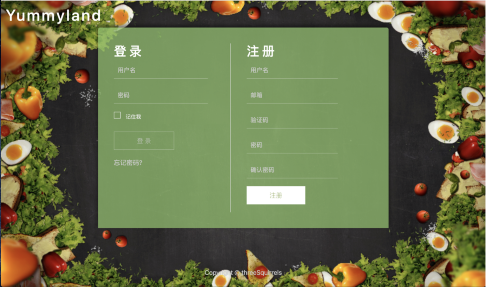
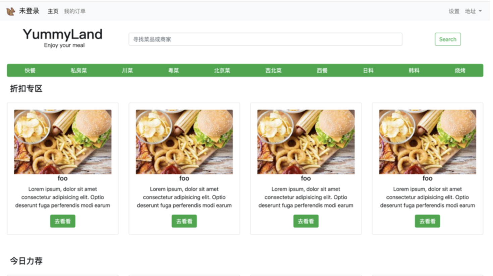
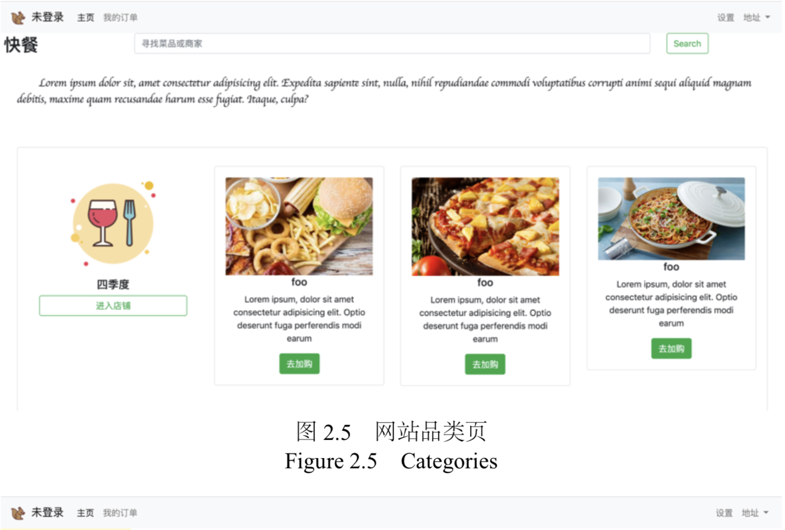
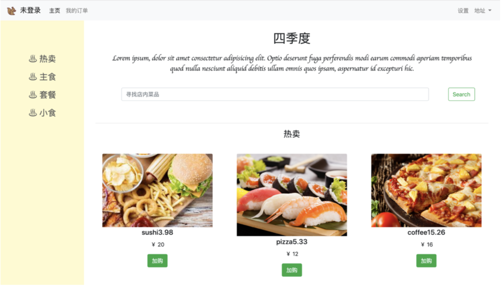
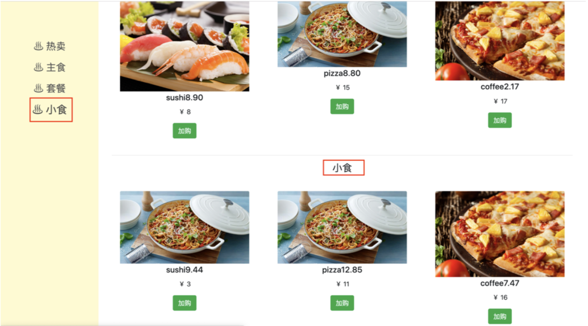
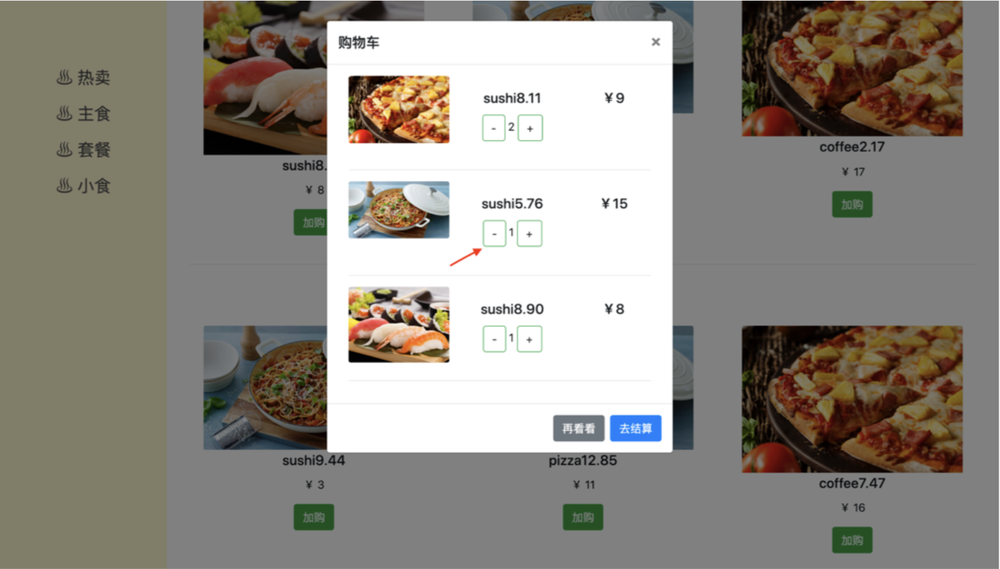
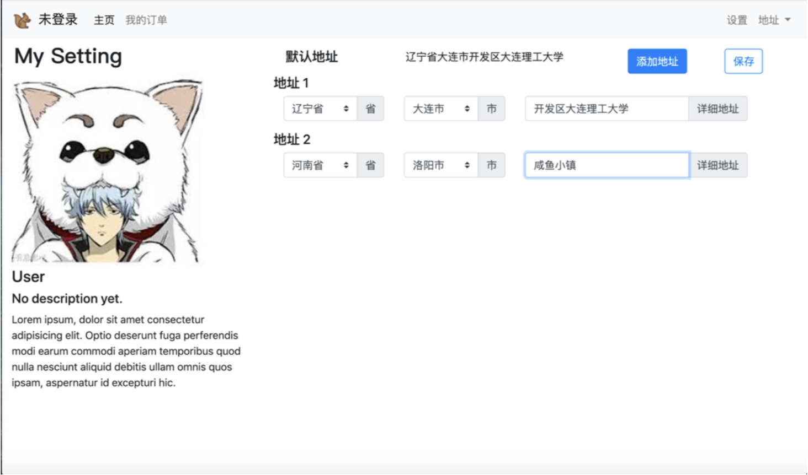
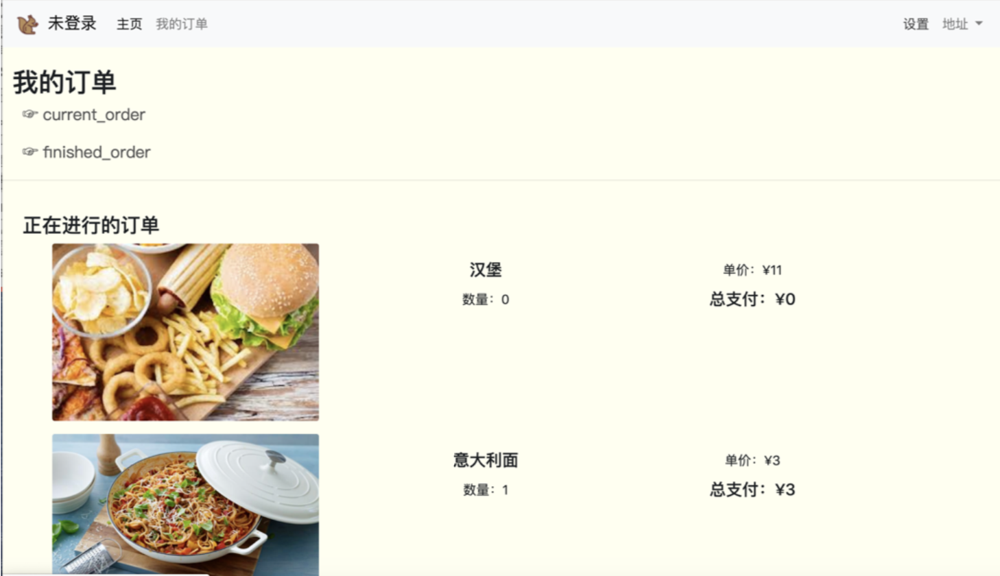

# YummyLand

Yummyland is a shopping website designed for buying food online, with boostrap and ajax built in front-end and flask in back-end.

Figures of site are following:

- Login & sign up

  

- Home

  

- A category of food

  

- A shop of the category:

  

- Choose food catogory of the shop:

  

- Add food into cart and sum up price

  

- User Settings

  

- Order checking 

  

